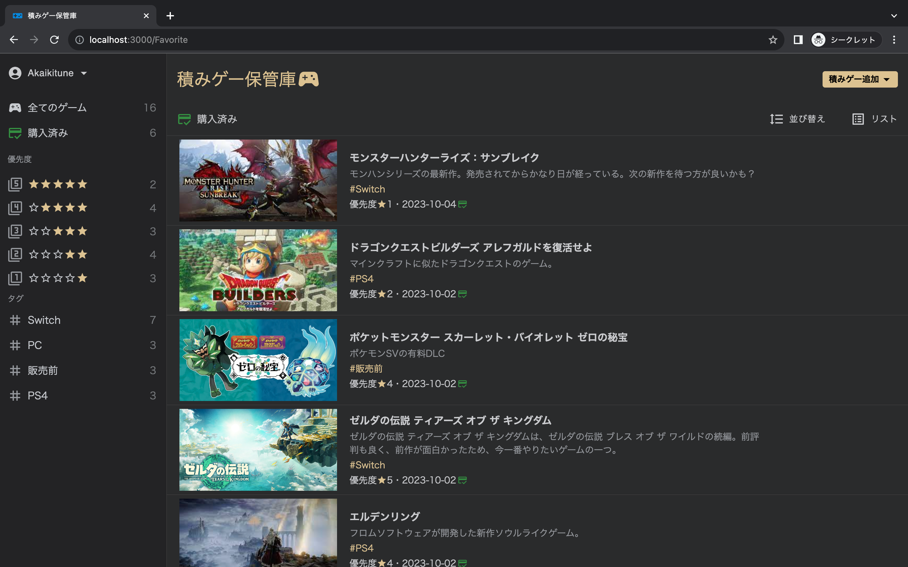
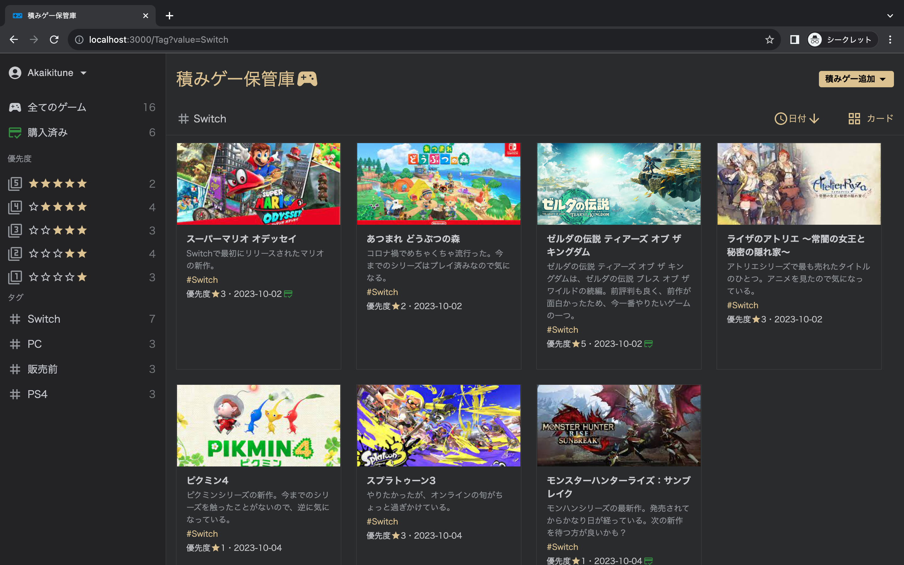
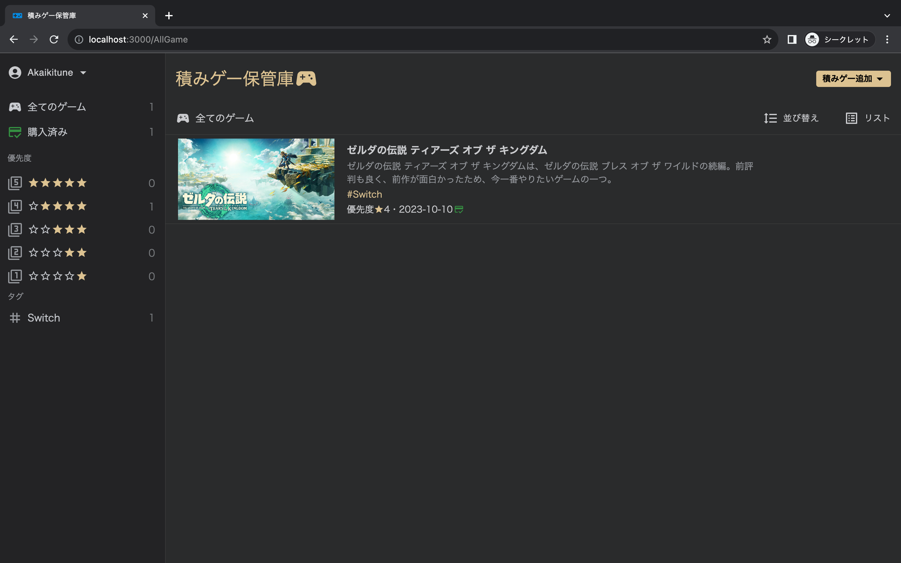

# プレビュー

本アプリは積みゲーを管理するアプリです． 
優先度や購入済みかどうか，設定したタグなどにまとめることができます． 
以下が実際に利用しているアカウントの画面です．

　

 

# 使用方法

1\. このように Email とパスワードを登録してアカウントを作成します．

2\. 次に作成したアカウントの Email とパスワードを以下のように入力します．

3\. ログインが完了すると以下のような画画面に遷移します．

4\. ホーム画面の右上にある積みゲーの追加ボタンを押下することで以下のようなモーダルウインドウが表示されます．

また，この画像のように「タイトル，概要，タグ，優先度，購入済みかどうか，画像」の情報を入力して積みゲーを追加できます．
※最低限タイトルを入力すれば，積みゲーを追加できます．

5\. 追加後の画面は以下のように表示されます．(左:リスト表示，右:カード表示)

　

6\. また，積みゲーにホバーすると表示される編集ボタンを押すことで追加した積みゲーの情報は編集できます． 
(右のゴミ箱ボタンを押すと積みゲーを削除できます．)

7\. 元々の情報が入っているので，変えたい情報を選択して適宜変更することができます．

8\. 最後に左上のボタンを押下することでログアウトをすることができます．

## おまけ

- ログアウトボタンの上部に名前の変更ボタンを追加しました．
- 以下に名前の変更ボタンを押した後のモーダルウインドウと結果を表示しています．
- 赤線が引かれているところを確認すると，名前が変わっていることがわかります．(DB 内も更新ボタンを押すと更新されます．)

